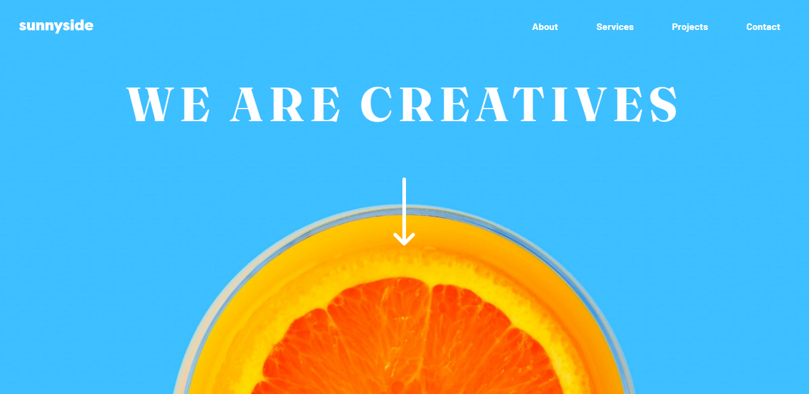

# Frontend Mentor - Sunnyside agency landing page solution

This is a solution to the [Sunnyside agency landing page challenge on Frontend Mentor](https://www.frontendmentor.io/challenges/sunnyside-agency-landing-page-7yVs3B6ef). Frontend Mentor challenges help you improve your coding skills by building realistic projects.

## Table of contents

- [Overview](#overview)
  - [The challenge](#the-challenge)
  - [Screenshot](#screenshot)
  - [Links](#links)
- [My process](#my-process)
  - [Built with](#built-with)
  - [What I learned](#what-i-learned)
  - [Continued development](#continued-development)
  - [Useful resources](#useful-resources)
- [Author](#author)
- [Acknowledgments](#acknowledgments)

**Note: Delete this note and update the table of contents based on what sections you keep.**

## Overview

### O desafio

Os usuários devem ser capazes de:

- Veja o layout ideal para o site, dependendo do tamanho da tela do dispositivo
- Veja os estados de foco para todos os elementos interativos na página

### Captura de tela

## Meu Processo

### Construído com

- Semantic HTML5 markup
- SCSS Propriedades personalizadas
- Flexbox
- CSS Grid

### O que eu aprendi

Use esta seção para recapitular alguns de seus principais aprendizados enquanto trabalhava neste projeto. Escrevê-los e fornecer amostras de código das áreas que você deseja destacar é uma ótima maneira de reforçar seu próprio conhecimento.

Para ver como você pode adicionar trechos de código, veja abaixo:

### Desenvolvimento contínuo

Use esta seção para delinear as áreas nas quais você deseja continuar focando em projetos futuros. Podem ser conceitos com os quais você ainda não está totalmente confortável ou técnicas que você achou úteis e que deseja refinar e aperfeiçoar.

**Observação: exclua esta observação e o conteúdo desta seção e substitua por seus próprios planos para o desenvolvimento contínuo.**

### Recursos Úteis

- [Exemplo de recurso 1](https://www.example.com) - Isso me ajudou pelo motivo XYZ. Eu realmente gostei desse padrão e vou usá-lo daqui para frente.
- [Exemplo de recurso 2](https://www.example.com) - Este é um artigo incrível que me ajudou a finalmente entender XYZ. Recomendo a todos que ainda estão aprendendo esse conceito.

**Observação: exclua esta observação e substitua a lista acima pelos recursos que o ajudaram durante o desafio. Isso pode ser útil para qualquer pessoa que esteja visualizando sua solução ou para você mesmo quando olhar para trás neste projeto no futuro.**

